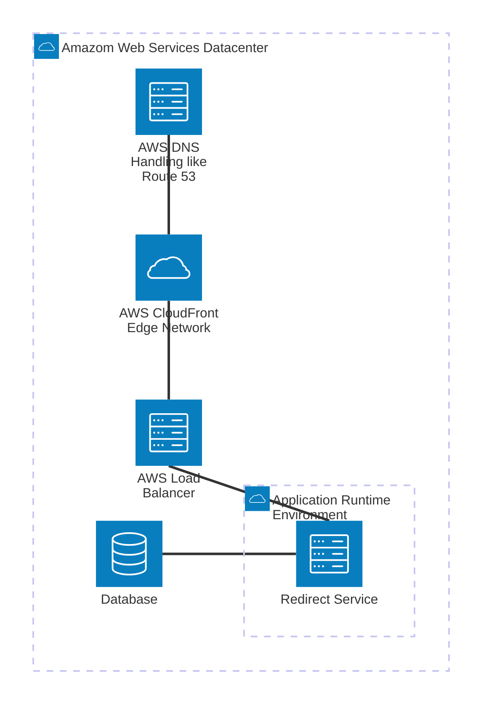

How to run

Populate the environment file:

```
cp .env.example .env
```

Populate the database (starts Postgres and imports the CSV):

```
make populate
```


Run tests:
```
go test ./...
```


Run locally:

```
make run
```


Make a request to `localhost:8080/buildfax/indeed`

```
> curl http://localhost:8080/buildfax/indeed
<a href="/technician/orchestrator">Moved Permanently</a>
```

## Project architecture
Follows a hexagonal architecture.
Domain logic lives in the `/internal` folder and defines the storage adapter it needs (to save and fetch rules).
`/storage` contains the implementations of those adapters (in-memory for testing, and Postgres for production use).

It can evolve as it grows. 

## Redirect Service

The Redirect Service lets you create redirect rules in the form of `From` and `To` URLs.
It internally canonicalizes `From` URLs for normalization, and redirects inbound requests to the corresponding `To` URLs when matched.

### Redirect logic
Redirecting uses strict matching. The incoming request must match the registered `From` URL’s path and query parameters.
#### Example Redirects

Suppose you have the following redirect rule:

```
From: /product?product=pixel&color=black
To:   /product/pixel-black
```

Here’s how different incoming requests would be handled:

| Incoming Request                                       | Match?      | Reason                                  |
|--------------------------------------------------------|-------------|-----------------------------------------|
| `/product?product=pixel&color=black`                   | ✅ MATCH    | Query params match exactly, any order   |
| `/product?color=black&product=pixel`                   | ✅ MATCH    | Params match, order doesn't matter      |
| `/product?color=black&product=pixel&extra=128gb`       | ❌ NO MATCH | Has extra query variable (`extra`)      |
| `/product?color=black`                                 | ❌ NO MATCH | Missing query variable (`product`)      |

> **Note:** Both the path and the set of query parameters must exactly match a registered rule. Extra or missing parameters will cause the redirect to not match.


### Supports Dynamic Configuration.
Postgres is the attached resource. The schema is in `./storage/postgres/schema.sql`.

`redirect_rules_full_match` can be updated to create new redirect rules or deprecate old ones.


### AWS Deployment Design


The Redirect Service is stateless and can be horizontally scaled.
CloudFront CDN can cache at the edge to improve performance.


### Next steps:
If more time is available, things to work on:

#### ADR:
There are some debatable topics on query params - what should match and what should not.
Active Decision Record document can be helpful to keep track of these decisions after clearifying the requirements and reasons for edge cases.

#### Security:
Customer-provided CSV files with redirect rules should be validated more strictly. They can introduce:
- cycles (ex: /a -> /b ; /b -> /a)
- SSRF-like issues (we do not make a request, but we forward the browser to the redirect URL).

#### Testing
- Integration tests with Postgres and with production data

#### Performance:

CDN-level caching should provide the best performance, but depending on cost and limits we can add app-level improvements such as:
- LRU caches for the most-visited URLs, stored in a distributed in-memory cache (Redis/Valkey).

